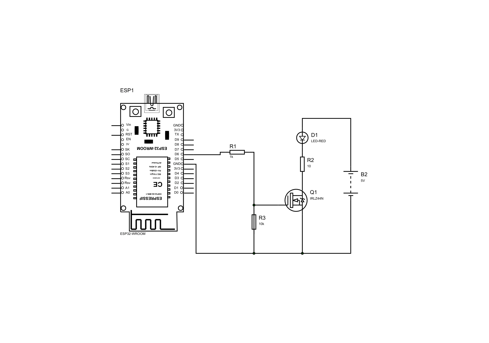
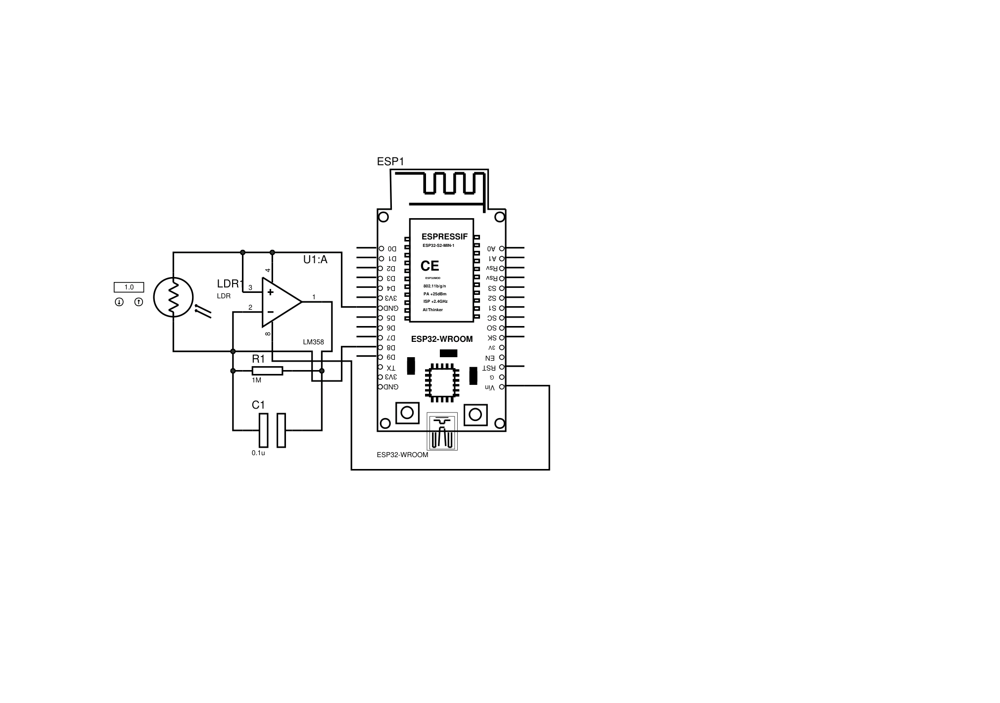
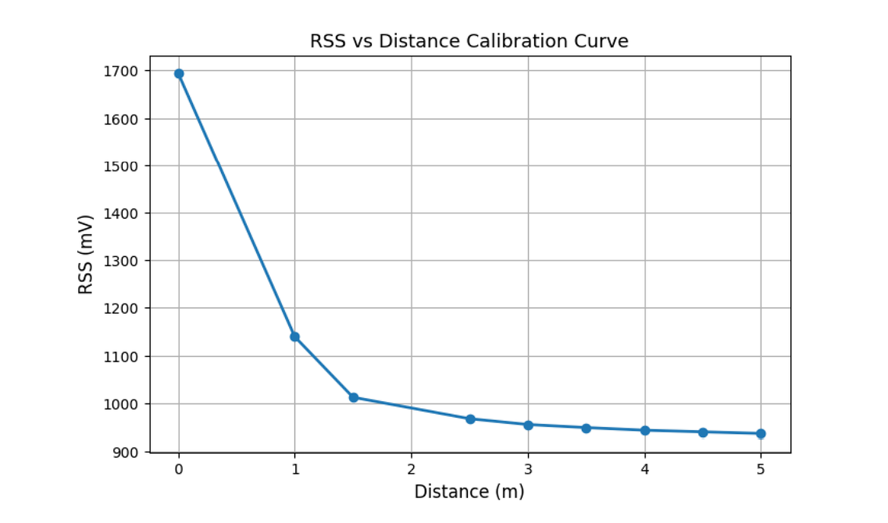

# Visible-Light-Communication-for-Indoor-Positioning
This project documents a system that uses visible light (LEDs) to determine the position of objects in a large indoor setting.

## 1. Why Is It Relevant?
Traditional indoor positioning systems (such as GPS) fail indoors due to severe signal attenuation and building obstruction. While radio frequency (RF) alternatives like Wi-Fi and Bluetooth are common, they suffer from multipath interference, signal noise, and limited spatial resolution. 

Visible Light Communication (VLC) and Visible Light Positioning (VLP) leverage existing LED lighting infrastructure for simultaneous illumination and data transmission. By utilizing high directivity and shorter wavelengths, VLC offers enhanced spatial resolution, immunity to electromagnetic interference, and secure indoor localization.

---

## 2. System Architecture & Overview
The project is split into two complementary experimental setups:
* **RSS-Based Localization Subsystem:** Utilizes pre-installed ceiling-mounted LED lighting as optical sources to correlate received signal strength (RSS) with physical distance.
* **Modulated Transmitter Subsystem:** Employs discrete, microcontroller-driven LEDs operating at distinct modulation frequencies ($500\,\text{Hz}, 1000\,\text{Hz}, 1500\,\text{Hz}$) to test multi-source signal separation via Fast Fourier Transform (FFT).

### **System Signal Flow**

*(Figure showing the sequential flow from LED Transmitters through the Optical Channel, Photodiode Receiver, and Processing Unit to the Positioning Output).*

---

## 3. What Did I Do?
* Designed and calibrated a complete optical wireless receiver pipeline using an ESP32 microcontroller and a silicon photodiode.
* Implemented a **low-side N-channel MOSFET switching circuit** (utilizing an IRL24N MOSFET) driven by ESP32 PWM signals to modulate discrete LED transmitters at specific frequencies.
* Developed an analog front-end (AFE) utilizing a Transimpedance Amplifier (TIA) with feedback filtering to condition raw photodiode current into measurable voltage.
* Implemented real-time digital signal processing (DSP) routines, including a 12-bit ADC sampling pipeline (at $8\,\text{kHz}$) and a 256-point Fast Fourier Transform (FFT) to isolate multi-carrier optical channels.
* Derived an empirical exponential decay model mapping RSS to distance, achieving a **0.53 m Mean Absolute Error (MAE)** and **0.66 m Root Mean Square Error (RMSE)** in near-field validation.

---

## 4. How Did I Do It? (Implementation & Technical Design)

### **Transmitter Side: MOSFET Low-Side Switching**
To achieve frequency modulation for transmitter identification, we used an **N-channel MOSFET configuration (specifically low-side switching)**. In this setup, the MOSFET acts as an electronic switch placed between the cathode of the LED (along with a current-limiting resistor) and ground. 
* The ESP32 digital output pin applies a Pulse Width Modulation (PWM) signal directly to the MOSFET gate. 
* When the gate voltage exceeds the threshold, the MOSFET turns on, completing the circuit loop and allowing current to flow through the LED. When the gate goes low, the switch opens, turning the LED off. 
* This configuration allows a low-power microcontroller pin to safely control and modulate higher-current optical transmitters without electrical feedback into the MCU.

*(Schematic of the ESP32 connected via gate resistors to an N-channel MOSFET driving the modulated LED).*

### **Receiver Side: Transimpedance Amplifier (TIA) & Filtering**
Photodiodes output a minute current proportional to incident light intensity[cite: 4]. To convert this current into a readable voltage for the ESP32’s analog-to-digital converter (ADC), we implemented a **Transimpedance Amplifier (TIA)** using an **LM358 operational amplifier**.
* **Why a TIA?** A standard resistor to ground would yield a poor voltage drop and weak sensitivity. A TIA uses an operational amplifier with a feedback resistor ($R_f = 1\,\text{M}\Omega$) connected between the output and the inverting input[cite: 4]. This virtually grounds the photodiode cathode while converting the input photocurrent into a clean, proportional output voltage ($V_{\text{out}} = I_{\text{ph}} \times R_f$).
* **Bandwidth Limitation & Stability ($R_f \vert{}\vert{} C_f$ Network):** Large feedback resistors create high gain but introduce instability and high-frequency noise susceptibility. To combat this, we placed a feedback capacitor ($C_f = 0.1\,\mu\text{F}$) in parallel with $R_f$[cite: 4]. This creates a first-order low-pass filter with a cutoff frequency
  $$f_c = \frac{1}{2\pi R_f C_f} \approx 1.59\,\text{Hz}$$
  This low cutoff frequency effectively suppresses high-frequency electronic noise and rapid ambient light fluctuations, ensuring stable, reliable RSS measurements ideal for positioning.

*(Schematic of the LM358 operational amplifier configured as a TIA with parallel $R_f$ and $C_f$ feedback).*

---

## 5. Challenges Faced & Engineering Solutions
1. **Insufficient Optical Intensity:** 
   * *Challenge:* Initial discrete LEDs produced weak optical power, leading to shallow RSS gradients and poor signal detection over distance.
   * *Solution:* Upgraded to higher-power LED configurations and integrated the **low-side N-channel MOSFET switching circuit** to drive the transmitters efficiently with an external $5\,\text{V}$ supply while maintaining clean PWM control from the ESP32.
2. **Small Receiver Gains & High Noise:**
   * *Challenge:* Raw photodiode outputs suffered from low signal levels and high-frequency ambient noise interference.
   * *Solution:* Implemented the **LM358-based Transimpedance Amplifier (TIA)** configuration with carefully tuned feedback component values ($R_f = 1\,\text{M}\Omega$ and $C_f = 0.1\,\mu\text{F}$). The op-amp configuration provided the necessary voltage scaling to match the ESP32's $0-3.3\,\text{V}$ ADC range, while the parallel capacitor acted as a low-pass filter to strip out high-frequency noise.

---

## 6. Results & Performance

### **RSS Calibration Curve**

*(Experimental calibration curve displaying exponential decay of RSS against distance from the dominant light source).*

* **Distance Estimation:** Validated across a $0-5\,\text{m}$ range, achieving high accuracy in the near-field region ($0-2\,\text{m}$) with an overall **MAE of $0.53\,\text{m}$** and **RMSE of $0.66\,\text{m}$**.
* **Transmitter Separation:** Successfully demonstrated simultaneous multi-transmitter discrimination using FFT spectral analysis, proving that frequency-division multiplexing can resolve overlapping optical sources.

---

## 7. Future Areas for Improvement
* Integrate high-power programmable lighting infrastructure capable of simultaneous wide-area illumination and frequency modulation.
* Implement advanced digital filtering or machine learning-based fingerprinting to mitigate ambient light plateaus at distances $>2.5\,\text{m}$.
* Upgrade receiver circuitry with adaptive gain control (AGC) to prevent saturation under direct illumination.
